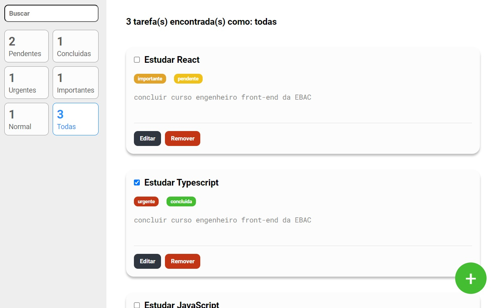

# 🏆 App Lista de tarefas

## ✔️ Tecnologias Utilizadas

 

## 📎 Sumario

- 📌 Resumo do Projeto
- 🛠️ Como executar o projeto
- ⭐ Desafio do Projeto
- 📂 Temas abordados
- 🙋🏻‍♂️ Autor

 

## 📌 Resumo do Projeto
Este projeto foi desenvolvido no curso engenheiro front-end da EBAC, e trata-se de uma aplicação de lista de tarefas, onde o usuário pode criar, editar e remover a tarefa. Além de efetuar buscas personalizadas pela prioridade, status ou mesmo nome da tarefa, foi utilizado React + TypeScript + redux + Styled-components no desenvolvimento do projeto.

 

## 🛠️ Como executar o projeto
Para executar este projeto localmente em sua máquina, siga estas etapas:

- Certifique-se de ter o Node.js instalado em sua máquina.

- Clone este repositório em sua máquina local usando o comando ``git clone``.

- Instale as dependências do projeto executando ``npm install`` no diretório do projeto.

- Execute o comando ``npm start`` para rodar o projeto.

 

## ⭐ Desafio do Projeto
O desafio consiste em construir a página de lista de tarefas e fazer com que pareça o mais próximo possível do design.

As ferramentas que deverão ser utilizadas são react, typescript, styled-components e redux.

A aplicação deve conter:

- As tarefas deverão conter titulo, descrição, status e prioridade;
- Deve ser possível criar, editar e excluir uma tarefa;
- Os botões de editar e remover devem ficar invisiveis para o usuario ao selcionar a edição em uma tarefa e os botões de salvar e cancelar devem ficar visiveis para o usuario;
- Deve ser possível editar o texto da tarefa;
- O usuario deve poder filtrar a tarefa pelo nome, independente se a letra for maiuscula ou minuscula;
- Deve ser possivel filtrar tarefas pelo status e prioridade;
- O cadastro de uma nova tarefa, deve ser feito em uma outra tela;
- Na pagina de cadastro de tarefa, não deve ser possível a exibição dos filtros de busca;
- O usuario devera ver o layout ideal para a interface dependendo do tamanho da tela do dispositivo
- O usuario devera ver os estados de foco e foco de todos os elementos interativos na página

 

## 📂 Temas abordados
- ``TypeScript``: Este projeto utiliza TypeScript, uma extensão tipada de JavaScript, para trazer um nível adicional de segurança e previsibilidade ao código. O TypeScript permite a detecção precoce de erros e fornece autocompletar melhorado no editor de código, tornando o desenvolvimento mais eficiente e menos propenso a erros.

- ``React``: O React é usado neste projeto para construir a interface do usuário. O React permite a criação de componentes reutilizáveis, tornando o código mais limpo e fácil de manter. Além disso, o React facilita a criação de interfaces de usuário interativas e dinâmicas.

- ``Redux``: Redux é uma biblioteca JavaScript de código aberto para gerenciar o estado do aplicativo. É mais comumente usado com bibliotecas associadas como React ou Angular para construir interfaces de usuário. Redux é usado neste projeto para gerenciar o estado do aplicativo de uma maneira previsível. Com o Redux, o estado do aplicativo é armazenado em um único objeto, facilitando o rastreamento de alterações ao longo do tempo e a depuração de problemas. Além disso, o Redux permite que você escreva lógica de negócios complexa em um local centralizado, em vez de espalhá-la por vários componentes.

- ``Styled Components``: Styled Components é uma biblioteca para estilizar componentes React. Neste projeto, Styled Components é usado para escrever CSS em JavaScript, permitindo que os estilos sejam dinâmicos e baseados em props. Isso também ajuda a manter os estilos encapsulados no componente, evitando conflitos de estilo e tornando o código mais limpo.

 

## 🙋🏻‍♂️ Autor

| [ Bruno Oliveira](https://github.com/BrunoOliveira16) |
| :---: |
